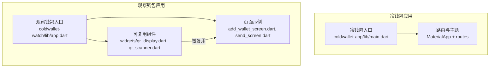
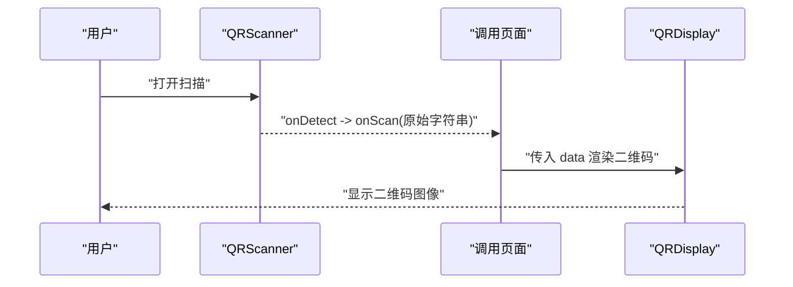
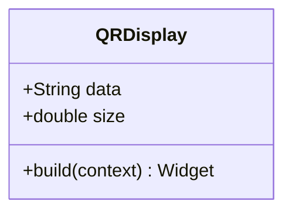
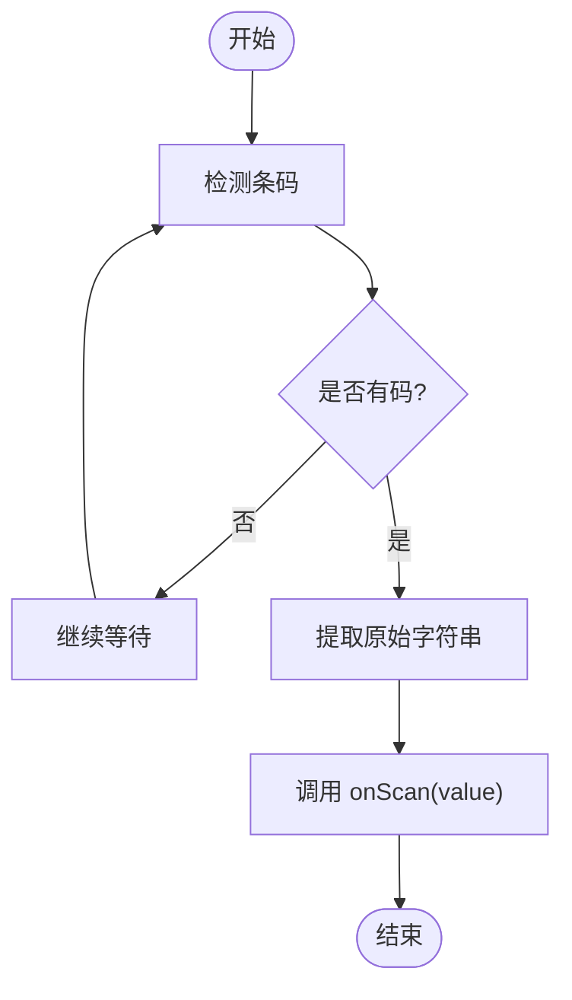
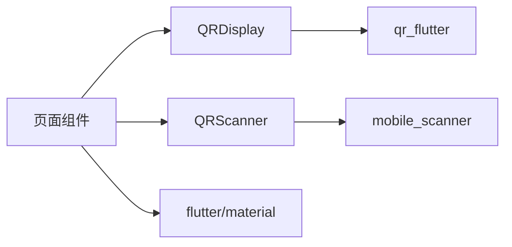

# 通用UI组件

<cite>
**本文引用的文件**
- [coldwallet-app/lib/main.dart](file://coldwallet-app/lib/main.dart)
- [coldwallet-watch/lib/app.dart](file://coldwallet-watch/lib/app.dart)
- [coldwallet-watch/lib/widgets/README.md](file://coldwallet-watch/lib/widgets/README.md)
- [coldwallet-watch/lib/widgets/qr_display.dart](file://coldwallet-watch/lib/widgets/qr_display.dart)
- [coldwallet-watch/lib/widgets/qr_scanner.dart](file://coldwallet-watch/lib/widgets/qr_scanner.dart)
- [coldwallet-watch/lib/screens/add_wallet_screen.dart](file://coldwallet-watch/lib/screens/add_wallet_screen.dart)
- [coldwallet-watch/lib/screens/send_screen.dart](file://coldwallet-watch/lib/screens/send_screen.dart)
- [coldwallet-app/lib/screens/confirm_sign_screen.dart](file://coldwallet-app/lib/screens/confirm_sign_screen.dart)
- [coldwallet-watch/pubspec.yaml](file://coldwallet-watch/pubspec.yaml)
- [coldwallet-app/pubspec.yaml](file://coldwallet-app/pubspec.yaml)
</cite>

## 目录
1. [简介](#简介)
2. [项目结构](#项目结构)
3. [核心组件](#核心组件)
4. [架构总览](#架构总览)
5. [详细组件分析](#详细组件分析)
6. [依赖分析](#依赖分析)
7. [性能考虑](#性能考虑)
8. [故障排查指南](#故障排查指南)
9. [结论](#结论)
10. [附录](#附录)

## 简介
本文件聚焦 ColdWallet 项目中可复用的界面组件，重点覆盖二维码显示与扫描等基础能力，并说明其在两个应用（冷钱包 App 与观察钱包）中的主题、响应式与跨平台适配方式。文档包含组件属性配置、事件处理、样式定制、主题支持、使用示例、最佳实践与性能优化建议，以及无障碍访问与跨平台兼容性说明，并提供组件组合模式与扩展开发指南。

## 项目结构
- 冷钱包应用（coldwallet-app）：提供离线签名流程的页面与路由，采用 Material3 主题。
- 观察钱包应用（coldwallet-watch）：提供在线交互页面，并在 widgets 模块中封装了可复用的二维码显示与扫描组件。
- 主题与启动页：通过 MaterialApp 配置亮/暗主题；Android 端通过 values/values-night 区分亮/暗启动背景。

图表来源
- [coldwallet-app/lib/main.dart:20-48](file://coldwallet-app/lib/main.dart#L20-L48)
- [coldwallet-watch/lib/app.dart:15-39](file://coldwallet-watch/lib/app.dart#L15-L39)

章节来源
- [coldwallet-app/lib/main.dart:20-48](file://coldwallet-app/lib/main.dart#L20-L48)
- [coldwallet-watch/lib/app.dart:15-39](file://coldwallet-watch/lib/app.dart#L15-L39)

## 核心组件
- QRDisplay：二维码显示组件，封装第三方库以统一尺寸与背景色。
- QRScanner：二维码扫描组件，封装摄像头扫描能力，扫描成功后回调原始字符串。
- 页面内常用控件：输入框（TextField）、按钮（FilledButton/ElevatedButton）、加载指示器（CircularProgressIndicator），在多个页面中复用。

章节来源
- [coldwallet-watch/lib/widgets/README.md:1-26](file://coldwallet-watch/lib/widgets/README.md#L1-L26)
- [coldwallet-watch/lib/widgets/qr_display.dart:1-18](file://coldwallet-watch/lib/widgets/qr_display.dart#L1-L18)
- [coldwallet-watch/lib/widgets/qr_scanner.dart:1-26](file://coldwallet-watch/lib/widgets/qr_scanner.dart#L1-L26)
- [coldwallet-watch/lib/screens/add_wallet_screen.dart:88-111](file://coldwallet-watch/lib/screens/add_wallet_screen.dart#L88-L111)
- [coldwallet-watch/lib/screens/send_screen.dart:120-142](file://coldwallet-watch/lib/screens/send_screen.dart#L120-L142)
- [coldwallet-app/lib/screens/confirm_sign_screen.dart:121-144](file://coldwallet-app/lib/screens/confirm_sign_screen.dart#L121-L144)

## 架构总览
- 主题体系：两应用均启用 Material3，并通过 ColorScheme.fromSeed 定义亮/暗主题，确保组件在不同主题下具有一致的视觉语义。
- 组件分层：widgets 层仅负责 UI 展示与事件回调，不耦合业务逻辑；screens 层负责业务流程编排与状态管理。
- 数据流：QRScanner 捕获条码后通过回调向调用方传递原始字符串；QRDisplay 根据传入数据渲染二维码。

图表来源
- [coldwallet-watch/lib/widgets/qr_scanner.dart:7-24](file://coldwallet-watch/lib/widgets/qr_scanner.dart#L7-L24)
- [coldwallet-watch/lib/widgets/qr_display.dart:7-16](file://coldwallet-watch/lib/widgets/qr_display.dart#L7-L16)

## 详细组件分析

### QRDisplay 组件
- 职责：封装二维码渲染，统一尺寸与背景色。
- 属性
  - data：二维码内容（必填）
  - size：二维码尺寸（默认值由实现决定）
- 事件：无
- 样式定制：可通过 size 控制大小；背景色固定为白色以保证对比度。
- 主题支持：遵循宿主应用的 Material 主题；如需跟随主题背景，可在外层容器设置主题色。
- 使用示例路径
  - 在页面中直接传入 data 与 size 即可渲染二维码。
- 最佳实践
  - 将二维码置于有足够留白的容器中，避免贴边导致裁剪。
  - 在大屏设备上适当增大 size 以提升可读性。
- 性能建议
  - 避免频繁重建 QRDisplay；若数据不变，尽量复用实例或缓存结果。
- 无障碍
  - 建议在父级添加语义标签，描述二维码内容用途（如“交易哈希二维码”）。

图表来源
- [coldwallet-watch/lib/widgets/qr_display.dart:7-16](file://coldwallet-watch/lib/widgets/qr_display.dart#L7-L16)

章节来源
- [coldwallet-watch/lib/widgets/qr_display.dart:1-18](file://coldwallet-watch/lib/widgets/qr_display.dart#L1-L18)

### QRScanner 组件
- 职责：封装摄像头扫码，成功时回调原始字符串。
- 属性
  - onScan：扫描成功回调（必填），接收原始字符串。
- 事件：内部监听条码检测，过滤空结果后回调。
- 样式定制：组件本身不暴露外观参数；可在外层包裹容器自定义边框、提示文案等。
- 主题支持：遵循系统相机权限与主题；注意在暗色模式下保证取景框可见性。
- 使用示例路径
  - 在页面中引入 QRScanner，实现 onScan 回调处理扫描结果。
- 最佳实践
  - 在 onScan 中做去抖与重复识别处理，避免重复提交。
  - 结合错误提示与权限引导，提升用户体验。
- 性能建议
  - 仅在需要时启动扫描；完成后可暂停或销毁以避免资源占用。
- 无障碍
  - 为扫描区域提供语义描述，便于读屏器理解当前操作。

图表来源
- [coldwallet-watch/lib/widgets/qr_scanner.dart:7-24](file://coldwallet-watch/lib/widgets/qr_scanner.dart#L7-L24)

章节来源
- [coldwallet-watch/lib/widgets/qr_scanner.dart:1-26](file://coldwallet-watch/lib/widgets/qr_scanner.dart#L1-L26)

### 输入框与按钮（页面内复用）
- 输入框（TextField）
  - 常见属性：控制器、键盘类型、装饰（labelText、边框等）。
  - 使用示例路径：[添加钱包页面输入区:88-94](file://coldwallet-watch/lib/screens/add_wallet_screen.dart#L88-L94)、[发送页面数量输入:120-126](file://coldwallet-watch/lib/screens/send_screen.dart#L120-L126)。
  - 最佳实践：对输入进行即时校验与格式化；为不同平台选择合适的 keyboardType。
- 按钮（FilledButton / ElevatedButton）
  - 常见属性：禁用态、图标、文本、样式。
  - 使用示例路径：[保存按钮与加载态:96-111](file://coldwallet-watch/lib/screens/add_wallet_screen.dart#L96-L111)、[下一步按钮与加载态:128-142](file://coldwallet-watch/lib/screens/send_screen.dart#L128-L142)、[确认签名按钮与加载态:131-144](file://coldwallet-app/lib/screens/confirm_sign_screen.dart#L131-L144)。
  - 最佳实践：在异步任务期间禁用按钮并展示加载指示器，防止重复提交。
- 加载指示器（CircularProgressIndicator）
  - 用于表示进行中状态，通常与按钮组合使用。
  - 使用示例路径：同上按钮处。
  - 最佳实践：保持最小尺寸与合适的描边宽度，避免遮挡关键信息。

章节来源
- [coldwallet-watch/lib/screens/add_wallet_screen.dart:88-111](file://coldwallet-watch/lib/screens/add_wallet_screen.dart#L88-L111)
- [coldwallet-watch/lib/screens/send_screen.dart:120-142](file://coldwallet-watch/lib/screens/send_screen.dart#L120-L142)
- [coldwallet-app/lib/screens/confirm_sign_screen.dart:121-144](file://coldwallet-app/lib/screens/confirm_sign_screen.dart#L121-L144)

### 主题与样式定制
- 冷钱包应用：基于 seedColor 生成亮/暗主题，启用 Material3。
- 观察钱包应用：同样启用 Material3，并使用 seedColor 定义主题色。
- 主题影响范围：按钮、输入框、导航栏、对话框等均由主题驱动；二维码背景色固定为白色以确保对比度。

章节来源
- [coldwallet-app/lib/main.dart:20-48](file://coldwallet-app/lib/main.dart#L20-L48)
- [coldwallet-watch/lib/app.dart:15-39](file://coldwallet-watch/lib/app.dart#L15-L39)

### 响应式设计
- 布局策略：使用弹性布局与自适应尺寸，使二维码与表单在不同屏幕尺寸下表现良好。
- 二维码尺寸：可根据设备宽度动态调整 size，保证可读性与美观。
- 输入与按钮：在全宽容器中使用，适配手机与平板。

章节来源
- [coldwallet-watch/lib/widgets/qr_display.dart:7-16](file://coldwallet-watch/lib/widgets/qr_display.dart#L7-L16)
- [coldwallet-watch/lib/screens/add_wallet_screen.dart:96-111](file://coldwallet-watch/lib/screens/add_wallet_screen.dart#L96-L111)
- [coldwallet-watch/lib/screens/send_screen.dart:128-142](file://coldwallet-watch/lib/screens/send_screen.dart#L128-L142)

### 无障碍访问支持
- 语义化：为二维码与扫描区域提供描述性文本，便于读屏器传达意图。
- 对比度：二维码背景色设置为白色，确保在深色主题下仍具备足够对比度。
- 焦点与键盘：输入框支持键盘导航；按钮提供清晰的点击反馈。

章节来源
- [coldwallet-watch/lib/widgets/qr_display.dart:7-16](file://coldwallet-watch/lib/widgets/qr_display.dart#L7-L16)
- [coldwallet-watch/lib/screens/add_wallet_screen.dart:88-111](file://coldwallet-watch/lib/screens/add_wallet_screen.dart#L88-L111)

### 跨平台兼容性
- Flutter 框架：同时支持 Android、iOS、Web 等平台。
- 权限与相机：二维码扫描依赖系统相机权限，需在目标平台正确配置。
- 主题与启动页：Android 端通过 values 与 values-night 区分亮/暗启动背景，确保启动体验一致。

章节来源
- [coldwallet-watch/pubspec.yaml:30-47](file://coldwallet-watch/pubspec.yaml#L30-L47)
- [coldwallet-app/pubspec.yaml:30-47](file://coldwallet-app/pubspec.yaml#L30-L47)

## 依赖分析
- 外部依赖
  - qr_flutter：二维码渲染。
  - mobile_scanner：摄像头扫码。
  - flutter/material：Material 组件与主题。
- 内部依赖
  - widgets 层不依赖 models/services，保持纯 UI 与事件回调。
  - screens 层组合 widgets 与业务服务。

图表来源
- [coldwallet-watch/lib/widgets/qr_display.dart:1-18](file://coldwallet-watch/lib/widgets/qr_display.dart#L1-L18)
- [coldwallet-watch/lib/widgets/qr_scanner.dart:1-26](file://coldwallet-watch/lib/widgets/qr_scanner.dart#L1-L26)
- [coldwallet-watch/pubspec.yaml:30-47](file://coldwallet-watch/pubspec.yaml#L30-L47)
- [coldwallet-app/pubspec.yaml:30-47](file://coldwallet-app/pubspec.yaml#L30-L47)

章节来源
- [coldwallet-watch/lib/widgets/README.md:12-17](file://coldwallet-watch/lib/widgets/README.md#L12-L17)
- [coldwallet-watch/pubspec.yaml:30-47](file://coldwallet-watch/pubspec.yaml#L30-L47)
- [coldwallet-app/pubspec.yaml:30-47](file://coldwallet-app/pubspec.yaml#L30-L47)

## 性能考虑
- 避免不必要的重建：对 QRDisplay 与 QRScanner 的使用应尽量稳定，减少 rebuild。
- 扫描节流：在 onScan 中增加去抖逻辑，防止短时间内多次触发。
- 资源释放：完成扫描后及时停止或销毁扫描器，降低功耗。
- 大图片与大数据：二维码内容过长会影响渲染性能，建议限制长度或分段展示。

## 故障排查指南
- 扫描无输出
  - 检查是否授予相机权限；确认 onDetect 回调中 barcodes 非空。
  - 参考路径：[QRScanner 回调处理:14-22](file://coldwallet-watch/lib/widgets/qr_scanner.dart#L14-L22)
- 二维码显示异常
  - 检查 data 是否为空；确认 size 合理；必要时在外层容器设置背景色。
  - 参考路径：[QRDisplay 渲染:14-16](file://coldwallet-watch/lib/widgets/qr_display.dart#L14-L16)
- 按钮重复提交
  - 在异步任务期间禁用按钮并展示加载指示器。
  - 参考路径：[保存按钮加载态:96-111](file://coldwallet-watch/lib/screens/add_wallet_screen.dart#L96-L111)、[下一步按钮加载态:128-142](file://coldwallet-watch/lib/screens/send_screen.dart#L128-L142)、[确认签名按钮加载态:131-144](file://coldwallet-app/lib/screens/confirm_sign_screen.dart#L131-L144)

章节来源
- [coldwallet-watch/lib/widgets/qr_scanner.dart:14-22](file://coldwallet-watch/lib/widgets/qr_scanner.dart#L14-L22)
- [coldwallet-watch/lib/widgets/qr_display.dart:14-16](file://coldwallet-watch/lib/widgets/qr_display.dart#L14-L16)
- [coldwallet-watch/lib/screens/add_wallet_screen.dart:96-111](file://coldwallet-watch/lib/screens/add_wallet_screen.dart#L96-L111)
- [coldwallet-watch/lib/screens/send_screen.dart:128-142](file://coldwallet-watch/lib/screens/send_screen.dart#L128-L142)
- [coldwallet-app/lib/screens/confirm_sign_screen.dart:131-144](file://coldwallet-app/lib/screens/confirm_sign_screen.dart#L131-L144)

## 结论
本项目在 widgets 层提供了轻量且可复用的二维码显示与扫描组件，配合 Material3 主题与页面内常用控件，形成了统一的 UI 风格与交互体验。通过合理的属性设计、事件回调与加载态管理，保证了易用性与稳定性。后续可扩展更多基础组件（如卡片、对话框、通知等），并持续完善无障碍与跨平台适配。

## 附录
- 组件组合模式
  - 将 QRDisplay 与 QRScanner 组合到同一页面：先扫描得到数据，再渲染对应二维码。
  - 将输入框与按钮组合为表单区块，统一样式与行为。
- 扩展开发指南
  - 新增组件：遵循 widgets 层纯 UI 原则，仅暴露必要属性与回调。
  - 主题接入：优先使用主题色与尺寸变量，确保亮/暗主题一致性。
  - 测试建议：为组件编写单元测试与集成测试，覆盖边界条件与异常路径。