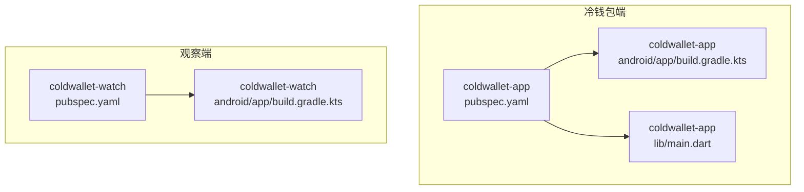
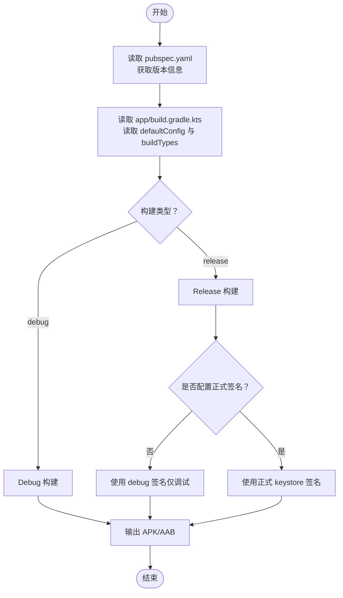
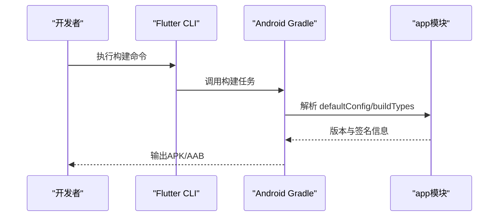
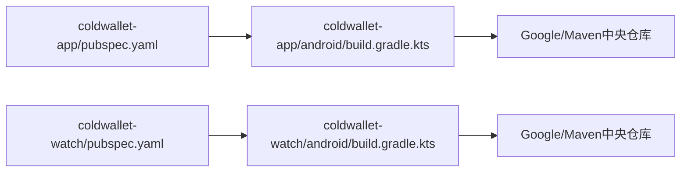
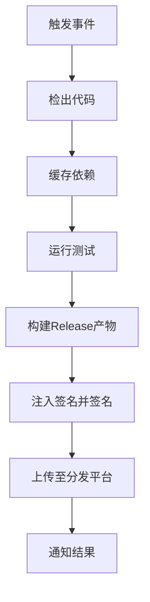

# 部署发布

<cite>
**本文引用的文件**
- [coldwallet-app/pubspec.yaml](file://coldwallet-app/pubspec.yaml)
- [coldwallet-app/android/app/build.gradle.kts](file://coldwallet-app/android/app/build.gradle.kts)
- [coldwallet-app/android/build.gradle.kts](file://coldwallet-app/android/build.gradle.kts)
- [coldwallet-app/android/gradle.properties](file://coldwallet-app/android/gradle.properties)
- [coldwallet-app/lib/main.dart](file://coldwallet-app/lib/main.dart)
- [coldwallet-watch/pubspec.yaml](file://coldwallet-watch/pubspec.yaml)
- [coldwallet-watch/android/app/build.gradle.kts](file://coldwallet-watch/android/app/build.gradle.kts)
- [coldwallet-watch/android/gradle.properties](file://coldwallet-watch/android/gradle.properties)
</cite>

## 目录
1. [简介](#简介)
2. [项目结构](#项目结构)
3. [核心组件](#核心组件)
4. [架构总览](#架构总览)
5. [详细组件分析](#详细组件分析)
6. [依赖分析](#依赖分析)
7. [性能考虑](#性能考虑)
8. [故障排查指南](#故障排查指南)
9. [结论](#结论)
10. [附录](#附录)

## 简介
本文件面向ColdWallet项目的生产级部署与发布，覆盖Android APK构建、签名配置、应用商店发布流程；说明生产环境配置、环境变量管理、日志与监控建议；给出版本管理策略、更新机制与回滚方案；提供CI/CD流水线配置要点、自动化部署步骤与发布检查清单，确保稳定上线。

## 项目结构
本项目包含两个Flutter子工程：
- coldwallet-app：冷钱包端（离线签名、助记词管理）
- coldwallet-watch：观察端（联网交互、扫码等）

两者均基于Flutter + Android Gradle构建，使用Kotlin与Java 17编译选项，通过pubspec.yaml管理Dart依赖与版本号。

图表来源
- [coldwallet-app/pubspec.yaml:1-100](file://coldwallet-app/pubspec.yaml#L1-L100)
- [coldwallet-app/android/app/build.gradle.kts:1-45](file://coldwallet-app/android/app/build.gradle.kts#L1-L45)
- [coldwallet-app/lib/main.dart:1-51](file://coldwallet-app/lib/main.dart#L1-L51)
- [coldwallet-watch/pubspec.yaml:1-101](file://coldwallet-watch/pubspec.yaml#L1-L101)
- [coldwallet-watch/android/app/build.gradle.kts:1-45](file://coldwallet-watch/android/app/build.gradle.kts#L1-L45)

章节来源
- [coldwallet-app/pubspec.yaml:1-100](file://coldwallet-app/pubspec.yaml#L1-L100)
- [coldwallet-watch/pubspec.yaml:1-101](file://coldwallet-watch/pubspec.yaml#L1-L101)
- [coldwallet-app/android/app/build.gradle.kts:1-45](file://coldwallet-app/android/app/build.gradle.kts#L1-L45)
- [coldwallet-watch/android/app/build.gradle.kts:1-45](file://coldwallet-watch/android/app/build.gradle.kts#L1-L45)

## 核心组件
- 版本与包名
  - 冷钱包端：包名 com.coldwallet.coldwallet_app，版本由 pubspec.yaml 的 version 字段驱动，Android侧通过 flutter.versionCode/flutter.versionName 注入。
  - 观察端：包名 com.coldwallet.coldwallet_watch，版本同理。
- 构建类型
  - 当前release构建默认使用debug签名，需替换为正式签名以用于发布。
- 入口与路由
  - 冷钱包端入口在 lib/main.dart，定义Material主题与基础路由。

章节来源
- [coldwallet-app/android/app/build.gradle.kts:8-31](file://coldwallet-app/android/app/build.gradle.kts#L8-L31)
- [coldwallet-watch/android/app/build.gradle.kts:8-31](file://coldwallet-watch/android/app/build.gradle.kts#L8-L31)
- [coldwallet-app/pubspec.yaml:7-19](file://coldwallet-app/pubspec.yaml#L7-L19)
- [coldwallet-watch/pubspec.yaml:7-19](file://coldwallet-watch/pubspec.yaml#L7-L19)
- [coldwallet-app/lib/main.dart:11-48](file://coldwallet-app/lib/main.dart#L11-L48)

## 架构总览
下图展示从代码到APK的关键构建路径与关键配置文件的关系。

图表来源
- [coldwallet-app/pubspec.yaml:7-19](file://coldwallet-app/pubspec.yaml#L7-L19)
- [coldwallet-app/android/app/build.gradle.kts:22-39](file://coldwallet-app/android/app/build.gradle.kts#L22-L39)
- [coldwallet-watch/pubspec.yaml:7-19](file://coldwallet-watch/pubspec.yaml#L7-L19)
- [coldwallet-watch/android/app/build.gradle.kts:22-39](file://coldwallet-watch/android/app/build.gradle.kts#L22-L39)

## 详细组件分析

### APK构建流程（冷钱包端）
- 版本来源
  - 版本字符串与构建号来自 pubspec.yaml 的 version 字段，Android侧通过 flutter.versionCode/flutter.versionName 映射。
- 构建目标
  - 使用Android Gradle插件与Flutter Gradle插件组合构建，编译SDK与NDK版本由Gradle配置决定。
- 构建类型
  - release 构建当前使用debug签名，需替换为正式签名方可上架。
- 产物
  - 生成APK或AAB（取决于发布渠道要求）。

图表来源
- [coldwallet-app/android/app/build.gradle.kts:1-45](file://coldwallet-app/android/app/build.gradle.kts#L1-L45)
- [coldwallet-app/pubspec.yaml:7-19](file://coldwallet-app/pubspec.yaml#L7-L19)

章节来源
- [coldwallet-app/android/app/build.gradle.kts:22-39](file://coldwallet-app/android/app/build.gradle.kts#L22-L39)
- [coldwallet-app/pubspec.yaml:7-19](file://coldwallet-app/pubspec.yaml#L7-L19)

### APK构建流程（观察端）
- 与冷钱包端一致，版本来源于其自身的 pubspec.yaml，Android侧同样通过 flutter.versionCode/flutter.versionName 注入。
- release 构建同样默认使用debug签名，需替换为正式签名。

章节来源
- [coldwallet-watch/android/app/build.gradle.kts:22-39](file://coldwallet-watch/android/app/build.gradle.kts#L22-L39)
- [coldwallet-watch/pubspec.yaml:7-19](file://coldwallet-watch/pubspec.yaml#L7-L19)

### 签名配置（生产环境）
- 现状
  - 两个工程的 release 构建类型均指向 debug 签名，仅便于本地调试。
- 生产要求
  - 必须配置正式的keystore与签名别名，并在CI中安全注入密钥材料。
  - 建议使用独立于开发环境的密钥保管库（如密钥管理服务或受保护的变量）。
- 建议步骤
  - 生成并妥善保管 keystore。
  - 在Gradle中配置 signingConfigs 指向正式keystore。
  - 将签名凭据作为CI/CD机密变量注入，避免写入仓库。

章节来源
- [coldwallet-app/android/app/build.gradle.kts:33-39](file://coldwallet-app/android/app/build.gradle.kts#L33-L39)
- [coldwallet-watch/android/app/build.gradle.kts:33-39](file://coldwallet-watch/android/app/build.gradle.kts#L33-L39)

### 应用商店发布步骤
- 准备产物
  - 确认已使用正式签名构建出APK/AAB。
- 元数据
  - 根据各商店要求填写应用名称、描述、截图、隐私政策等。
- 上传与审核
  - 上传至Google Play或其他分发渠道，等待审核通过后发布。
- 灰度与全量
  - 建议先灰度小流量用户，验证稳定性后逐步放量。

章节来源
- [coldwallet-app/android/app/build.gradle.kts:22-39](file://coldwallet-app/android/app/build.gradle.kts#L22-L39)
- [coldwallet-watch/android/app/build.gradle.kts:22-39](file://coldwallet-watch/android/app/build.gradle.kts#L22-L39)

### 生产环境配置与环境变量管理
- 现状
  - 未发现集中式的环境变量配置文件；应用入口未显式加载外部配置。
- 建议
  - 使用构建时注入的方式区分环境（例如通过Gradle属性或构建变体），避免在代码中硬编码敏感信息。
  - 对需要运行时切换的配置，采用安全的存储与最小权限访问策略。
  - 对网络端点、功能开关等配置，建议在服务端或受控配置中心管理，客户端通过只读方式获取。

章节来源
- [coldwallet-app/lib/main.dart:11-48](file://coldwallet-app/lib/main.dart#L11-L48)

### 日志配置与监控设置
- 现状
  - 未发现内置的日志与监控集成。
- 建议
  - 接入崩溃上报与远程日志服务，按环境控制日志级别与采样率。
  - 对关键业务埋点（如签名失败、二维码扫描异常）进行统计与告警。
  - 在生产环境关闭调试输出，减少性能开销与敏感信息泄露风险。

[本节为通用建议，不直接分析具体文件]

### 版本管理策略
- 版本来源
  - Dart层版本由 pubspec.yaml 的 version 字段统一管理。
  - Android侧通过 flutter.versionCode/flutter.versionName 自动映射。
- 建议
  - 使用语义化版本（主.次.修订），结合构建号实现增量升级。
  - 在CI中自动生成递增的构建号，并与Git标签关联。

章节来源
- [coldwallet-app/pubspec.yaml:7-19](file://coldwallet-app/pubspec.yaml#L7-L19)
- [coldwallet-watch/pubspec.yaml:7-19](file://coldwallet-watch/pubspec.yaml#L7-L19)
- [coldwallet-app/android/app/build.gradle.kts:22-31](file://coldwallet-app/android/app/build.gradle.kts#L22-L31)
- [coldwallet-watch/android/app/build.gradle.kts:22-31](file://coldwallet-watch/android/app/build.gradle.kts#L22-L31)

### 更新机制
- 现状
  - 未发现内置的在线更新逻辑。
- 建议
  - 若需支持热更新或版本检查，应在服务端提供版本接口，客户端定期比对并提示更新。
  - 对于冷钱包类应用，优先通过应用商店强制/推荐更新，保证安全性与一致性。

[本节为通用建议，不直接分析具体文件]

### 回滚方案
- 应用商店
  - 若新版本出现问题，可回退到上一稳定版本或下架新版本。
- 本地与测试
  - 保留历史构建产物与对应Git标签，便于快速定位与复现。
- 配置回滚
  - 配置变更应遵循“可回滚”原则，配合配置中心实现一键回滚。

[本节为通用建议，不直接分析具体文件]

## 依赖分析
- Dart依赖
  - 两个工程均在各自 pubspec.yaml 中声明依赖，包括Cardano SDK、加密库、文件选择器等。
- Android构建依赖
  - 统一使用Google与Maven Central仓库，Gradle版本与JVM参数在 gradle.properties 中配置。

图表来源
- [coldwallet-app/pubspec.yaml:24-47](file://coldwallet-app/pubspec.yaml#L24-L47)
- [coldwallet-watch/pubspec.yaml:24-47](file://coldwallet-watch/pubspec.yaml#L24-L47)
- [coldwallet-app/android/build.gradle.kts:1-6](file://coldwallet-app/android/build.gradle.kts#L1-L6)
- [coldwallet-watch/android/app/build.gradle.kts:1-6](file://coldwallet-watch/android/app/build.gradle.kts#L1-L6)

章节来源
- [coldwallet-app/android/build.gradle.kts:1-6](file://coldwallet-app/android/build.gradle.kts#L1-L6)
- [coldwallet-app/android/gradle.properties:1-4](file://coldwallet-app/android/gradle.properties#L1-L4)
- [coldwallet-watch/android/gradle.properties:1-3](file://coldwallet-watch/android/gradle.properties#L1-L3)

## 性能考虑
- Gradle内存
  - 已在 gradle.properties 中配置较大的JVM堆与元空间，有助于大型项目构建。
- 编译选项
  - Java/Kotlin目标版本设置为17，确保与新工具链兼容。
- 构建优化
  - 合理使用并行构建与缓存，缩短CI时间。

章节来源
- [coldwallet-app/android/gradle.properties:1-4](file://coldwallet-app/android/gradle.properties#L1-L4)
- [coldwallet-watch/android/gradle.properties:1-3](file://coldwallet-watch/android/gradle.properties#L1-L3)
- [coldwallet-app/android/app/build.gradle.kts:13-20](file://coldwallet-app/android/app/build.gradle.kts#L13-L20)
- [coldwallet-watch/android/app/build.gradle.kts:13-20](file://coldwallet-watch/android/app/build.gradle.kts#L13-L20)

## 故障排查指南
- 构建失败
  - 检查Gradle版本与JDK版本是否与项目要求一致。
  - 清理构建缓存后重试。
- 签名问题
  - 确认release构建已配置正式签名，且keystore与别名正确。
  - 校验签名后的APK/AAB是否可通过平台校验。
- 版本不一致
  - 核对pubspec.yaml与Android侧versionCode/versionName是否同步。

章节来源
- [coldwallet-app/android/app/build.gradle.kts:33-39](file://coldwallet-app/android/app/build.gradle.kts#L33-L39)
- [coldwallet-watch/android/app/build.gradle.kts:33-39](file://coldwallet-watch/android/app/build.gradle.kts#L33-L39)
- [coldwallet-app/pubspec.yaml:7-19](file://coldwallet-app/pubspec.yaml#L7-L19)
- [coldwallet-watch/pubspec.yaml:7-19](file://coldwallet-watch/pubspec.yaml#L7-L19)

## 结论
当前项目具备清晰的Flutter+Android构建结构，版本与包名管理清晰。生产发布前需完成正式签名配置、完善环境变量与日志监控、建立CI/CD自动化流水线与发布检查清单。通过严格的版本管理与回滚策略，可保障生产环境的稳定发布与快速恢复。

## 附录

### CI/CD流水线配置要点
- 触发条件
  - 推送至主干或创建发布标签时触发构建与发布。
- 构建阶段
  - 安装依赖、运行静态检查与单元测试、构建release产物。
- 签名阶段
  - 从机密库读取keystore与别名，注入Gradle构建过程。
- 发布阶段
  - 上传至应用商店或内部分发平台，记录构建产物与日志。

[本节为通用建议，不直接分析具体文件]

### 自动化部署流程

[本节为通用建议，不直接分析具体文件]

### 发布检查清单
- 代码质量
  - 静态检查通过、单元测试通过。
- 构建与签名
  - 使用正式签名构建成功，产物校验通过。
- 版本与元数据
  - 版本号符合语义化规范，应用商店元数据完整。
- 环境与配置
  - 生产环境变量正确注入，无敏感信息泄露。
- 监控与日志
  - 崩溃上报与日志采集已启用，告警规则配置完成。
- 回滚预案
  - 回滚流程演练过，具备快速回退能力。

[本节为通用建议，不直接分析具体文件]