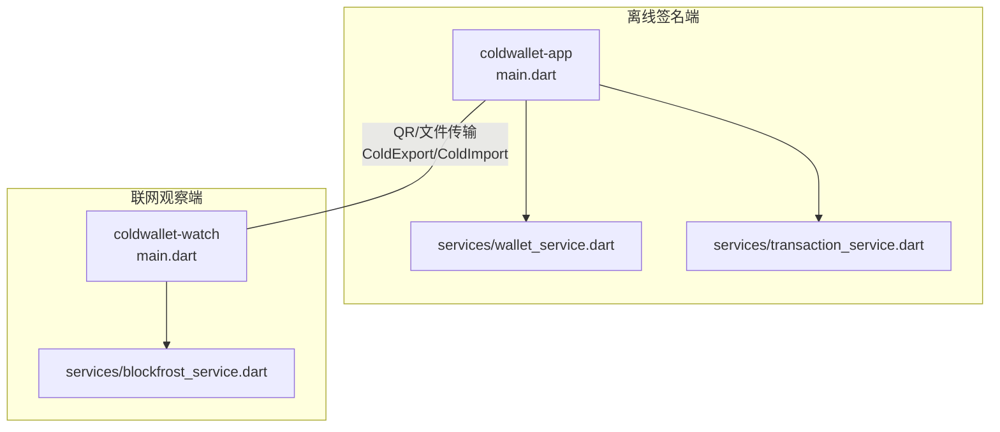
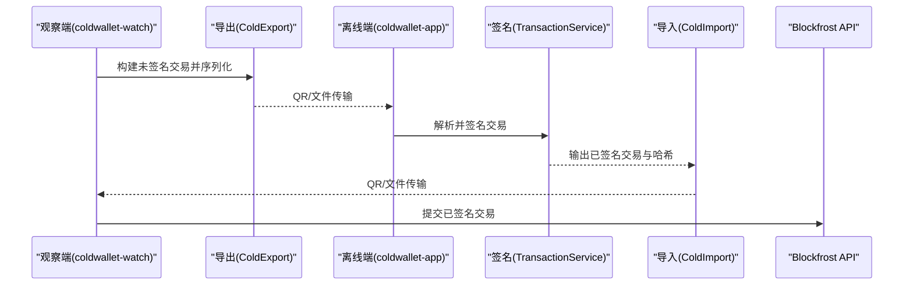
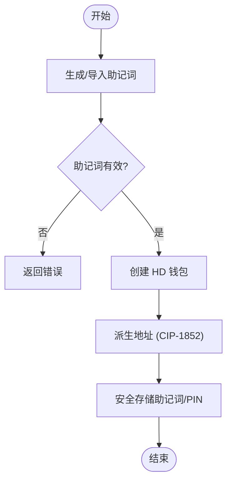
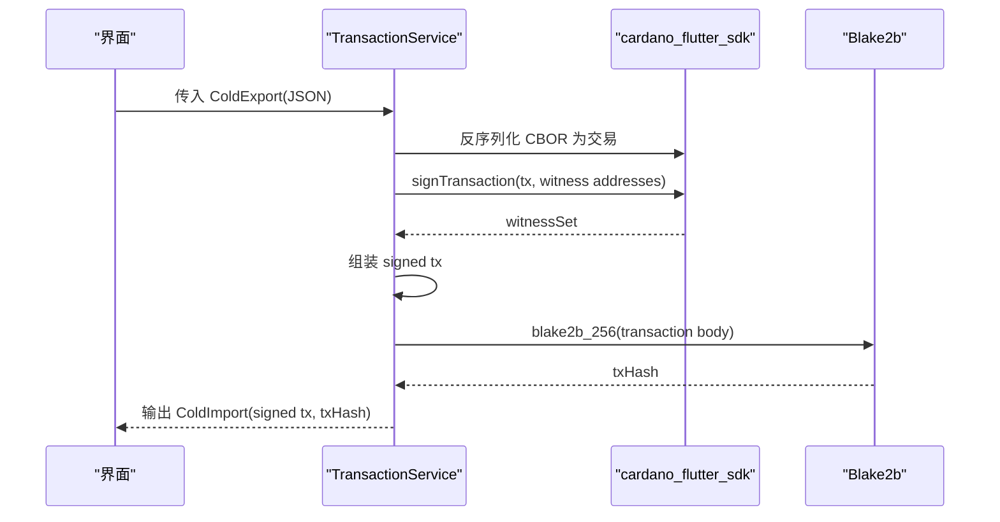
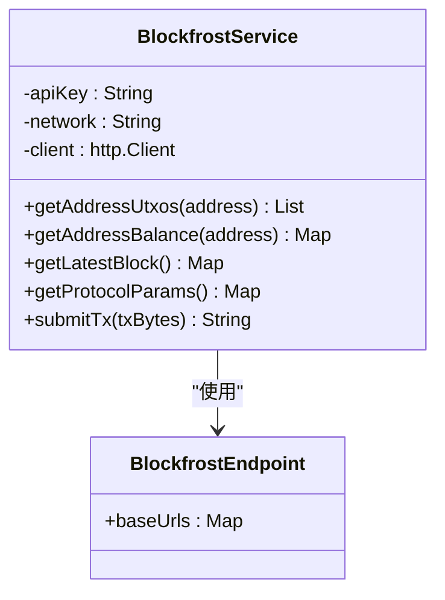
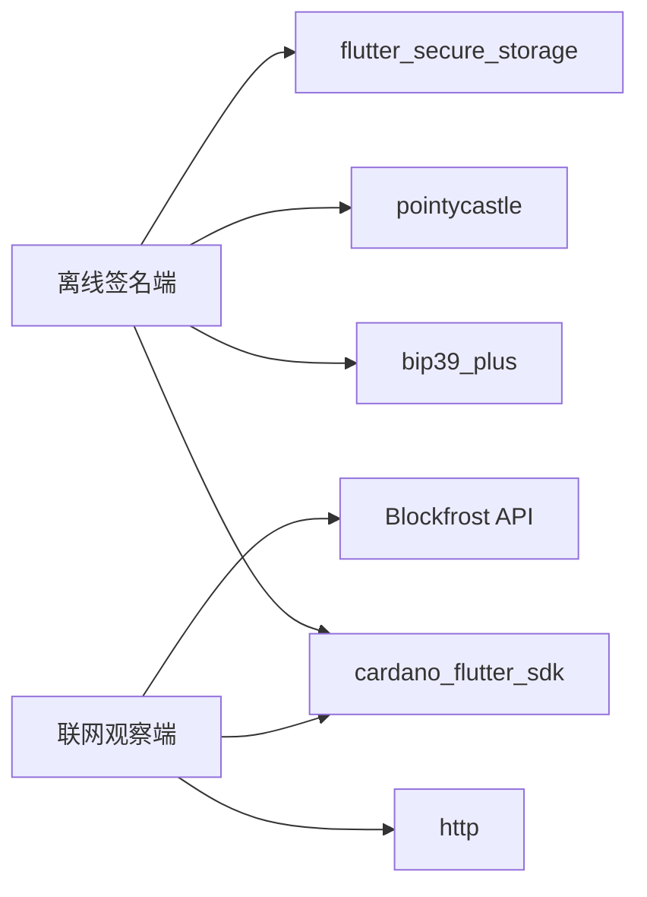

# 项目概述

<cite>
**本文引用的文件**
- [cold-wallet-plugin.md](file://cold-wallet-plugin.md)
- [2026-08-10-cold-wallet-design.md](file://docs/superpowers/specs/2026-08-10-cold-wallet-design.md)
- [2026-08-13-cold-wallet-watch.md](file://docs/superpowers/plans/2026-08-13-cold-wallet-watch.md)
- [coldwallet-app/main.dart](file://coldwallet-app/lib/main.dart)
- [coldwallet-watch/main.dart](file://coldwallet-watch/lib/main.dart)
- [coldwallet-app/wallet_service.dart](file://coldwallet-app/lib/services/wallet_service.dart)
- [coldwallet-app/transaction_service.dart](file://coldwallet-app/lib/services/transaction_service.dart)
- [coldwallet-watch/blockfrost_service.dart](file://coldwallet-watch/lib/services/blockfrost_service.dart)
</cite>

## 目录
1. [简介](#简介)
2. [项目结构](#项目结构)
3. [核心组件](#核心组件)
4. [架构总览](#架构总览)
5. [详细组件分析](#详细组件分析)
6. [依赖关系分析](#依赖关系分析)
7. [性能与安全考量](#性能与安全考量)
8. [故障排查指南](#故障排查指南)
9. [结论](#结论)
10. [附录](#附录)

## 简介
ColdWallet 是一个面向 Cardano 的冷钱包系统，采用“离线签名端 + 联网观察端”的双端架构。其安全模型的核心是：私钥与助记词仅存在于离线设备中，永不触网；联网端只持有公钥地址，负责查询余额、构建未签名交易、提交已签名交易。两端通过二维码或文件在设备间传递 CBOR 编码的交易数据（unsignedTx.cbor / signedTx.cbor），实现安全的离线签名流程。

本项目包含两个 Flutter 应用：
- coldwallet-app：离线签名端，负责助记词管理、PIN 验证、解析未签名交易、使用本地私钥签名并导出已签名交易。
- coldwallet-watch：联网观察端，负责只读地址管理、余额查询、构建未签名交易、导入签名结果并提交到链上。

设计文档明确了 MVP 范围（ADA 转账与原生代币转账）、技术选型（Flutter、cardano_flutter_sdk、Blockfrost、CIP-1852 BIP32-Ed25519）以及设备间数据交换格式（JSON 包装 + CBOR 交易体）。

**章节来源**
- [cold-wallet-plugin.md:10-150](file://cold-wallet-plugin.md#L10-L150)
- [2026-08-10-cold-wallet-design.md:10-62](file://docs/superpowers/specs/2026-08-10-cold-wallet-design.md#L10-L62)

## 项目结构
仓库由三个主要部分组成：
- coldwallet-app（离线签名端）：Flutter Android 应用，提供助记词生成/导入、PIN 设置、扫码解析未签名交易、离线签名、导出已签名交易等功能。
- coldwallet-watch（联网观察端）：Flutter Android 应用，提供只读钱包管理、余额查询、构建未签名交易、导入签名结果并提交到链上。
- 设计文档与计划：specs 与 plans 目录定义了整体架构、接口契约、开发顺序与里程碑。

**图表来源**
- [coldwallet-app/main.dart:1-51](file://coldwallet-app/lib/main.dart#L1-L51)
- [coldwallet-watch/main.dart:1-12](file://coldwallet-watch/lib/main.dart#L1-L12)
- [coldwallet-app/wallet_service.dart:1-208](file://coldwallet-app/lib/services/wallet_service.dart#L1-L208)
- [coldwallet-app/transaction_service.dart:1-70](file://coldwallet-app/lib/services/transaction_service.dart#L1-L70)
- [coldwallet-watch/blockfrost_service.dart:1-109](file://coldwallet-watch/lib/services/blockfrost_service.dart#L1-L109)

**章节来源**
- [2026-08-10-cold-wallet-design.md:32-73](file://docs/superpowers/specs/2026-08-10-cold-wallet-design.md#L32-L73)
- [2026-08-13-cold-wallet-watch.md:1-10](file://docs/superpowers/plans/2026-08-13-cold-wallet-watch.md#L1-L10)

## 核心组件
- 离线签名端服务
  - 钱包服务：助记词生成/校验、HD 钱包创建、地址派生（CIP-1852）、多钱包管理、PIN 管理。
  - 交易服务：解析 ColdExport、使用 cardano_flutter_sdk 进行 Ed25519 扩展签名、计算交易哈希（blake2b_256）、输出 ColdImport。
- 联网观察端服务
  - Blockfrost 服务：查询 UTxO、余额、协议参数、最新区块，提交已签名交易到链上。
  - 钱包服务：只读钱包增删改查、当前钱包切换、地址格式校验。

这些组件共同实现了“离线签名、联网提交”的安全闭环。

**章节来源**
- [coldwallet-app/wallet_service.dart:1-208](file://coldwallet-app/lib/services/wallet_service.dart#L1-L208)
- [coldwallet-app/transaction_service.dart:1-70](file://coldwallet-app/lib/services/transaction_service.dart#L1-L70)
- [coldwallet-watch/blockfrost_service.dart:1-109](file://coldwallet-watch/lib/services/blockfrost_service.dart#L1-L109)

## 架构总览
双端架构通过 JSON 包装 + CBOR 交易体的数据契约进行通信：
- 插件/观察端构建 unsigned tx → 序列化为 ColdExport（含 summary 元信息）→ 以 QR/文件形式导出。
- 离线 App 扫描/导入 → 解析 ColdExport → 展示交易详情 → PIN 验证后签名 → 输出 ColdImport（signed tx + txHash）。
- 观察端导入 ColdImport → 提交 signed tx 到链上。

**图表来源**
- [2026-08-10-cold-wallet-design.md:299-345](file://docs/superpowers/specs/2026-08-10-cold-wallet-design.md#L299-L345)
- [coldwallet-app/transaction_service.dart:26-57](file://coldwallet-app/lib/services/transaction_service.dart#L26-L57)
- [coldwallet-watch/blockfrost_service.dart:92-107](file://coldwallet-watch/lib/services/blockfrost_service.dart#L92-L107)

**章节来源**
- [cold-wallet-plugin.md:55-80](file://cold-wallet-plugin.md#L55-L80)
- [2026-08-10-cold-wallet-design.md:299-345](file://docs/superpowers/specs/2026-08-10-cold-wallet-design.md#L299-L345)

## 详细组件分析

### 离线签名端：钱包服务（助记词与地址派生）
- 功能要点
  - 生成 24 词助记词（基于 SDK 安全随机源）。
  - 从骰子熵生成助记词（256 bits → BIP-39）。
  - 校验助记词有效性。
  - 从助记词创建 HD 钱包并派生第一个外部支付地址（CIP-1852）。
  - 多钱包管理与当前钱包切换。
  - PIN 设置与验证（全局）。
- 安全要点
  - 私钥与助记词仅保存在安全存储（Android Keystore）。
  - 无网络请求代码，避免私钥泄露风险。

**图表来源**
- [coldwallet-app/wallet_service.dart:20-78](file://coldwallet-app/lib/services/wallet_service.dart#L20-L78)
- [coldwallet-app/wallet_service.dart:96-127](file://coldwallet-app/lib/services/wallet_service.dart#L96-L127)
- [coldwallet-app/wallet_service.dart:135-192](file://coldwallet-app/lib/services/wallet_service.dart#L135-L192)

**章节来源**
- [coldwallet-app/wallet_service.dart:1-208](file://coldwallet-app/lib/services/wallet_service.dart#L1-L208)

### 离线签名端：交易服务（签名与哈希）
- 功能要点
  - 解析 ColdExport（未签名交易的 JSON 包装）。
  - 使用 cardano_flutter_sdk 将 CBOR 反序列化为交易对象，并用本地私钥签名。
  - 组装已签名交易并计算交易哈希（blake2b_256）。
  - 输出 ColdImport（已签名交易与哈希）。
- 安全要点
  - 签名过程完全离线，不引入 HTTP 库。
  - 签名后立即清理引用，避免私钥驻留内存。

**图表来源**
- [coldwallet-app/transaction_service.dart:26-57](file://coldwallet-app/lib/services/transaction_service.dart#L26-L57)
- [coldwallet-app/transaction_service.dart:59-68](file://coldwallet-app/lib/services/transaction_service.dart#L59-L68)

**章节来源**
- [coldwallet-app/transaction_service.dart:1-70](file://coldwallet-app/lib/services/transaction_service.dart#L1-L70)

### 联网观察端：Blockfrost 服务（链上交互）
- 功能要点
  - 查询地址 UTxO、余额、最新区块、协议参数。
  - 提交已签名交易到链上（application/cbor）。
- 安全要点
  - API Key 存储在安全存储。
  - 仅用于只读查询与交易提交，不接触私钥。

**图表来源**
- [coldwallet-watch/blockfrost_service.dart:9-15](file://coldwallet-watch/lib/services/blockfrost_service.dart#L9-L15)
- [coldwallet-watch/blockfrost_service.dart:21-107](file://coldwallet-watch/lib/services/blockfrost_service.dart#L21-L107)

**章节来源**
- [coldwallet-watch/blockfrost_service.dart:1-109](file://coldwallet-watch/lib/services/blockfrost_service.dart#L1-L109)

### 应用入口与路由
- 离线签名端入口配置 Material3 主题与路由（首页、钱包设置、扫码签名）。
- 联网观察端入口启动应用，作为只读观察钱包。

**章节来源**
- [coldwallet-app/main.dart:1-51](file://coldwallet-app/lib/main.dart#L1-L51)
- [coldwallet-watch/main.dart:1-12](file://coldwallet-watch/lib/main.dart#L1-L12)

## 依赖关系分析
- 离线签名端依赖
  - cardano_flutter_sdk：CIP-1852 地址派生、交易签名。
  - bip39_plus：助记词校验。
  - pointycastle：blake2b_256 计算交易哈希。
  - flutter_secure_storage：安全存储助记词与 PIN。
- 联网观察端依赖
  - cardano_flutter_sdk：地址校验与交易构建（MVP 阶段主要用于观察端构建未签名交易）。
  - http：调用 Blockfrost REST API。
  - shared_preferences/flutter_secure_storage：本地持久化与密钥存储。

**图表来源**
- [coldwallet-app/wallet_service.dart:1-208](file://coldwallet-app/lib/services/wallet_service.dart#L1-L208)
- [coldwallet-app/transaction_service.dart:1-70](file://coldwallet-app/lib/services/transaction_service.dart#L1-L70)
- [coldwallet-watch/blockfrost_service.dart:1-109](file://coldwallet-watch/lib/services/blockfrost_service.dart#L1-L109)

**章节来源**
- [2026-08-10-cold-wallet-design.md:283-297](file://docs/superpowers/specs/2026-08-10-cold-wallet-design.md#L283-L297)
- [2026-08-13-cold-wallet-watch.md:127-167](file://docs/superpowers/plans/2026-08-13-cold-wallet-watch.md#L127-L167)

## 性能与安全考量
- 性能
  - 小交易（< 3KB）可通过单张 QR 码承载，减少传输开销。
  - 使用 Blockfrost 缓存协议参数与 UTxO 列表可提升用户体验（后续迭代）。
- 安全
  - 私钥与助记词仅在离线设备出现，永不触网。
  - 签名前需 PIN 验证，防止误操作。
  - 安全存储使用 Android Keystore，降低密钥泄露风险。
  - 无网络请求代码在离线端，避免意外外发敏感数据。

[本节为通用指导，无需具体文件引用]

## 故障排查指南
- 助记词无效
  - 检查输入是否为标准 BIP-39 助记词，确保空格分隔且单词数正确。
  - 参考助记词校验逻辑与错误处理路径。
- 地址无效
  - 检查 bech32 前缀（addr1 / addr_test1）与长度。
  - 使用地址校验函数进行前置验证。
- 签名失败
  - 确认当前钱包已初始化且助记词可用。
  - 检查网络设置（测试网/主网）与交易 CBOR 是否匹配。
- 提交失败
  - 检查 Blockfrost API Key 与网络选择。
  - 查看响应状态码与错误消息，定位网络或服务端问题。

**章节来源**
- [coldwallet-app/wallet_service.dart:48-56](file://coldwallet-app/lib/services/wallet_service.dart#L48-L56)
- [coldwallet-watch/blockfrost_service.dart:44-66](file://coldwallet-watch/lib/services/blockfrost_service.dart#L44-L66)
- [coldwallet-watch/blockfrost_service.dart:92-107](file://coldwallet-watch/lib/services/blockfrost_service.dart#L92-L107)

## 结论
ColdWallet 通过“离线签名 + 联网观察”的双端架构，实现了高安全性的 Cardano 冷钱包体验。MVP 聚焦 ADA 与原生代币转账，采用 Flutter 与 cardano_flutter_sdk 保证跨平台一致性与安全性。设备间通过 JSON+CBOR 的数据契约进行可靠传输，结合 PIN 验证与安全存储，形成完整的安全闭环。后续可逐步扩展质押、治理投票、dApp 集成等能力。

[本节为总结性内容，无需具体文件引用]

## 附录
- 关键术语
  - 助记词：BIP-39 生成的单词序列，用于恢复私钥。
  - CIP-1852：Cardano 的 HD 钱包派生路径标准。
  - Ed25519 扩展签名：Cardano 使用的数字签名算法。
  - UTXO：未花费交易输出，Cardano 的账户模型基础。
  - CBOR：二进制序列化格式，用于交易体编码。
  - Blockfrost：Cardano 区块链数据 API 服务。

[本节为概念说明，无需具体文件引用]